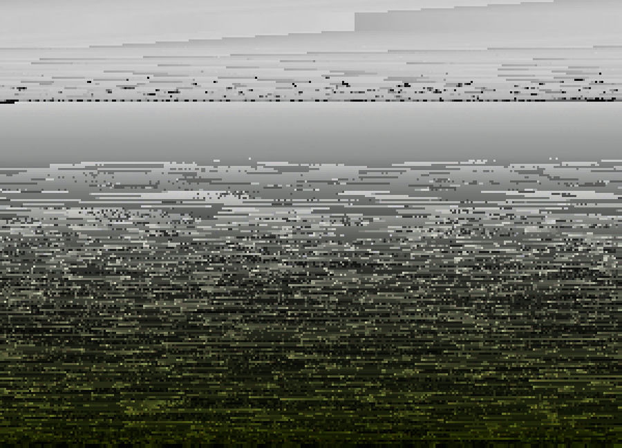
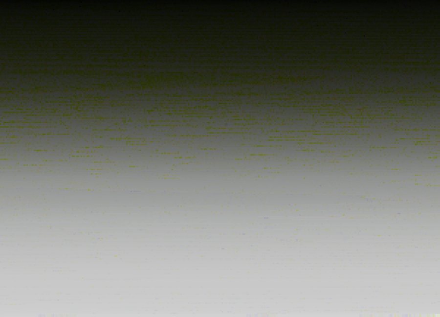

# Week 1: Araucária

From [Wikipedia](https://en.wikipedia.org/wiki/Araucaria):

> Araucaria (/ærɔːˈkɛəriə/; original pronunciation: [a.ɾawˈka. ɾja])[4] is a genus of evergreen coniferous trees in the family Araucariaceae. There are 20 extant species in New Caledonia (where 14 species are endemic, see New Caledonian Araucaria), Norfolk Island, eastern Australia, New Guinea, Argentina, Chile, and Brazil.

## Screenshots


## Explainer

These images were generated based on another image (not shown due to copyright), whose pixels were sorted according to their hue. The processed image — an array containing the reordered pixels — looks like this:


For reference, here is the same image reordered by saturation:



And by brightness:



The sorting algorithm was shamelessly ripped off from [here](https://www.cs.cmu.edu/~adamchik/15-121/lectures/Sorting%20Algorithms/sorting.html) and is simingly simple:

```processing
int[] bubbleSort(int ar[]) {
  for (int i = (ar.length - 1); i >= 0; i--){
    for (int j = 1; j <= i; j++){
      if (hue(ar[j-1]) > hue(ar[j])){
        int temp = ar[j-1];
        ar[j-1] = ar[j];
        ar[j] = temp;
      }
    }
  }
  return ar;
}
```

The 3rd line (`if (hue(ar[j-1]) > hue(ar[j])){`) first gets the pixel's hue value before comparing it with the previously found value.
