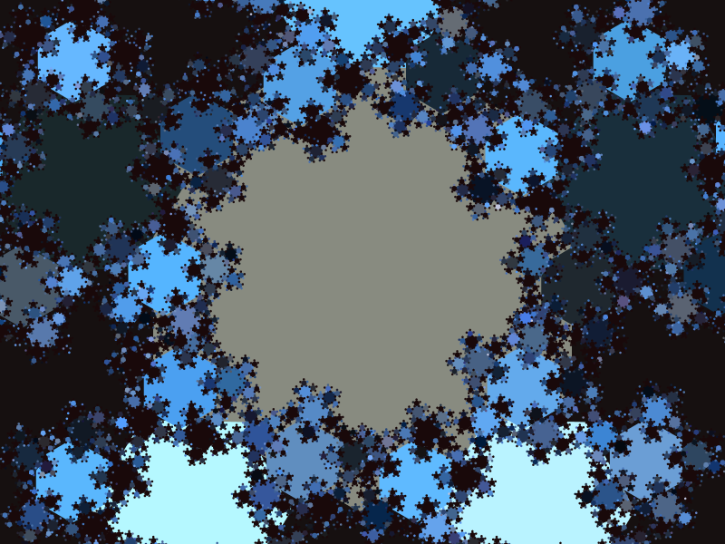
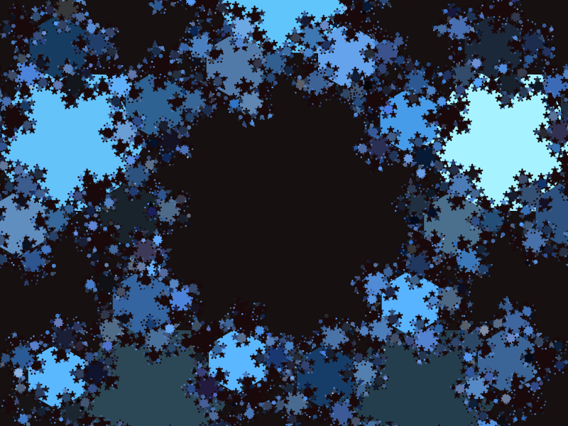
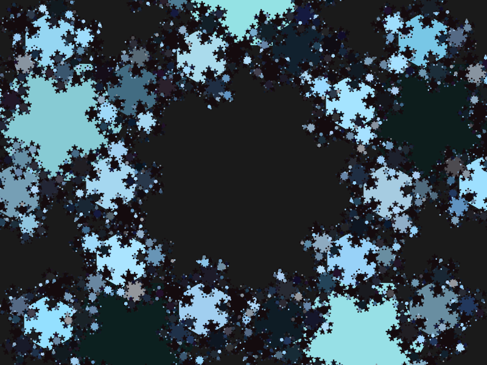
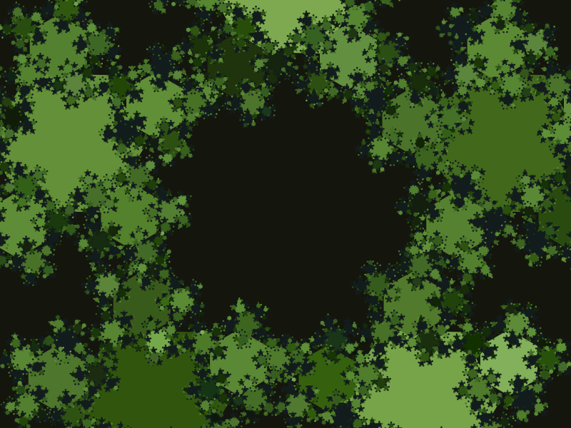

# Week 1: Araucária

From [Wikipedia](https://en.wikipedia.org/wiki/Araucaria):

> Araucaria (/ærɔːˈkɛəriə/; original pronunciation: [a.ɾawˈka. ɾja])[4] is a genus of evergreen coniferous trees in the family Araucariaceae. There are 20 extant species in New Caledonia (where 14 species are endemic, see New Caledonian Araucaria), Norfolk Island, eastern Australia, New Guinea, Argentina, Chile, and Brazil.

## Screenshots

